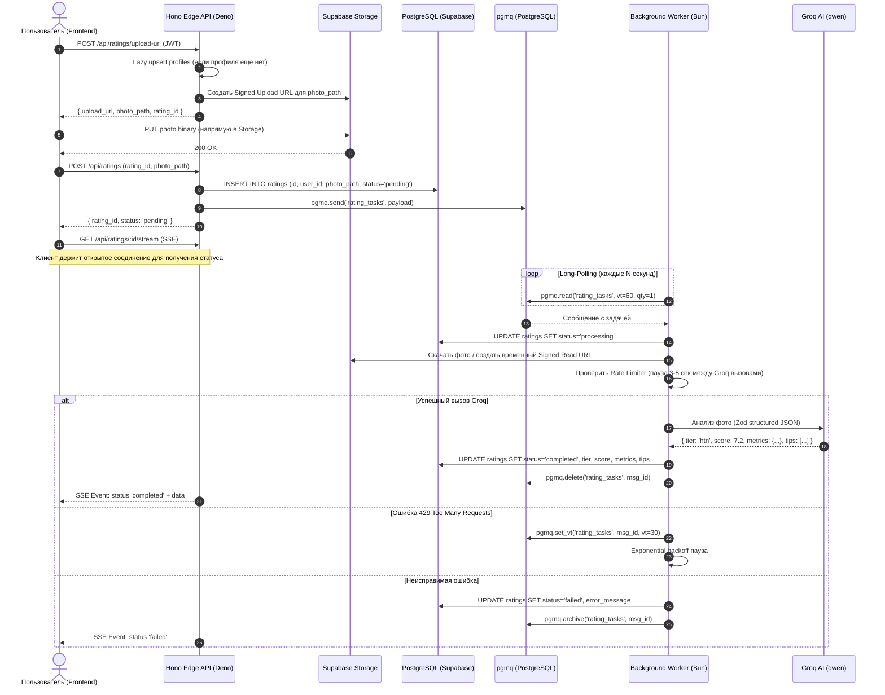

# AGENTS.md

> Руководство для AI-агентов и разработчиков по архитектуре, стеку технологий, правилам написания кода и взаимодействию компонентов бэкенда платформы ИИ-оценки внешности (Looksmaxxing AI Rating Platform).

---

## 1. Обзор проекта (Project Overview)

Проект представляет собой бэкенд для платформы оценки внешности по шкале луксмаксинга (Looksmaxxing tier list: `sub3`, `ltn`, `mtn`, `htn`, `chadlite`, `chad`, `true_adam`).

### MVP функционал:
1. **Личные кабинеты пользователей**: профили пользователей с ленивым созданием (lazy upsert) при первом запросе через Supabase Auth JWT.
2. **Хранение фото и история оценок**: безопасная загрузка фотографий в приватный Supabase Storage bucket через pre-signed upload URLs и сохранение всей истории оценок с метаданными.
3. **ИИ-оценка внешности через Groq**: структурированный анализ лица с использованием моделей Groq (JSON-режим по Zod-схеме: категория, числовой балл 1-10, детальные метрики лица и персональные рекомендации по улучшению внешности).
4. **Асинхронная очередь задач**: использование расширения `pgmq` (PostgreSQL Message Queue в Supabase) в качестве надежного брокера сообщений.
5. **Выделенный фоновый воркер**: долгоживущий процесс на **Bun**, осуществляющий sequential long-polling очереди `pgmq`.
6. **Rate Limiting бесплатного Groq API**: защита от лимитов (RPM / TPM) на уровне воркера через последовательную обработку, искусственную паузу между вызовами и экспоненциальный backoff с переносом visibility timeout в `pgmq`.
7. **Клиентские обновления в реальном времени**: Server-Sent Events (SSE) стриминг статуса обработки напрямую из Hono Edge Function.

---

## 2. Архитектура и матрица рантаймов (Runtime & Tech Stack Matrix)

Проект организован как монорепозиторий с четким разделением ответственности между рантаймами:

| Компонент | Рантайм / Инструмент | Директория | Описание |
| :--- | :--- | :--- | :--- |
| **Edge API** | **Deno** (Supabase Edge Runtime) + Hono | `supabase/functions/api/` | Единая HTTP Edge Function: роутинг, валидация, генерация pre-signed URLs, постановка задач в pgmq, SSE-стриминг |
| **Фоновый воркер** | **Bun** (Node-совместимый) | `worker/` | Долгоживущий скрипт long-polling `pgmq`, вызов Groq API, rate limiting, запись результатов в БД |
| **БД и Схема** | **Drizzle ORM** (PostgreSQL) | `db.schema.ts`, `drizzle.config.ts` | Декларативное описание таблиц, связей и типов. Минимальный сырой SQL |
| **CLI и Миграции** | **Bunx** (`bunx supabase`, `bunx drizzle-kit`) | Корень проекта | Управление локальным Supabase и генерация/применение миграций Drizzle |
| **Инфраструктура** | **Supabase** | `supabase/` | PostgreSQL 15+, Supabase Auth, Storage (private bucket), pgmq extension |

> [!IMPORTANT]
> **Строгие границы рантаймов:**
> - В `supabase/functions/api/` используется исключительно **Deno** (импорты через `jsr:`, `npm:`, `deno.json`). Не использовать Bun-специфичные API (`Bun.serve`, `bun:*`).
> - В `worker/` используется **Bun** (`bun run worker/index.ts`). Здесь доступны нативные быстрые API Bun или стандартные npm-пакеты.
> - Схемы БД объявляются только в `db.schema.ts` через Drizzle ORM. Избегать написания ручных SQL-скриптов за пределами миграций, сгенерированных через `bunx drizzle-kit`.

---

## 3. Структура монорепозитория (Directory Layout)

```text
mog/
├── AGENTS.md                     # Этот документ (архитектурный манифест проекта)
├── package.json                  # Корневой манифест (drizzle-orm, drizzle-kit, pg, типы Bun)
├── bun.lock                      # Lockfile Bun
├── tsconfig.json                 # TypeScript конфигурация для корня и воркера
├── drizzle.config.ts             # Конфигурация Drizzle Kit (подключение к Supabase Postgres)
├── db.schema.ts                  # Единая схема данных Drizzle (profiles, ratings, enums)
├── worker/                       # Долгоживущий фоновый воркер на Bun
│   ├── index.ts                  # Точка входа воркера (long-polling pgmq)
│   ├── groq.ts                   # Клиент Groq AI, системный промпт и Zod-валидация ответа
│   ├── queue.ts                  # Обертка над pgmq (read, delete, set_vt)
│   ├── limiter.ts                # Реализация троттлинга / задержек между запросами
│   └── package.json              # Зависимости воркера (если требуются специфичные пакеты)
└── supabase/                     # Конфигурация и Edge Functions Supabase
    ├── config.toml               # Конфигурация локального окружения Supabase
    ├── migrations/               # Миграции, сгенерированные drizzle-kit
    └── functions/
        └── api/                  # Единая Hono Edge Function на Deno
            ├── deno.json         # Маппинг импортов Deno (hono, zod, drizzle-orm, supabase-js)
            ├── deno.lock         # Lockfile Deno
            ├── index.ts          # Точка входа Hono приложения (app.fetch)
            ├── routes/           # Модульные эндпоинты
            │   ├── auth.ts       # /me профиль (lazy upsert)
            │   ├── ratings.ts    # /ratings (создание, получение списка, pre-signed upload URL)
            │   └── stream.ts     # /ratings/:id/stream (SSE стриминг статуса)
            └── middlewares/      # Аутентификация через Supabase Auth JWT, CORS, логгирование
```

---

## 4. Модель данных (Drizzle Schema: `db.schema.ts`)

Вся схема БД строго описывается в `db.schema.ts`.

### Ключевые таблицы:

1. **`profiles`**:
   - `id`: `uuid` primary key (ссылается на `auth.users.id`).
   - `username`: `text` (опционально / уникально).
   - `avatar_url`: `text` (опционально).
   - `created_at`: `timestamp with time zone` (default `now()`).
   - `updated_at`: `timestamp with time zone` (default `now()`).

2. **`ratings`**:
   - `id`: `uuid` primary key (default `gen_random_uuid()`).
   - `user_id`: `uuid` not null (foreign key -> `profiles.id` on delete cascade).
   - `photo_path`: `text` not null (относительный путь к файлу в приватном бакете Supabase Storage, например: `${userId}/${ratingId}.jpg`).
   - `status`: `text` / `enum` (`'pending'`, `'processing'`, `'completed'`, `'failed'`).
   - `tier`: `text` / `enum` (`'sub3'`, `'ltn'`, `'mtn'`, `'htn'`, `'chadlite'`, `'chad'`, `'true_adam'`) nullable.
   - `score`: `numeric(3, 1)` nullable (числовая оценка от 1.0 до 10.0).
   - `metrics`: `jsonb` nullable:
     - `canthal_tilt`: `text` (`'positive'`, `'neutral'`, `'negative'`).
     - `jawline`: `number` (1-10).
     - `symmetry`: `number` (1-10).
     - `skin_quality`: `number` (1-10).
     - `eye_area`: `number` (1-10).
     - `cheekbones`: `number` (1-10).
   - `looksmaxxing_tips`: `jsonb` nullable (массив строк с практическими рекомендациями по уходу, прическе, питанию, осанке и т.д.).
   - `raw_ai_response`: `jsonb` nullable (для отладки и аудита).
   - `error_message`: `text` nullable.
   - `created_at`: `timestamp with time zone` (default `now()`).
   - `completed_at`: `timestamp with time zone` nullable.

### Расширение `pgmq` (PostgreSQL Message Queue):
- Очередь создается командой: `SELECT pgmq.create('rating_tasks');`.
- Полезная нагрузка сообщения в очереди `rating_tasks`:
  ```json
  {
    "rating_id": "uuid",
    "user_id": "uuid",
    "photo_path": "profiles/user_id/rating_id.jpg",
    "created_at": "2026-09-09T18:00:00Z"
  }
  ```

---

## 5. Поток работы системы (End-to-End Workflow)



---

## 6. Спецификация компонентов

### 6.1. Hono Edge Function (`supabase/functions/api/`)
- **Базовый путь**: `/functions/v1/api` (или пользовательский через gateway).
- **Роуты**:
  - `GET /me`: Получить текущий профиль пользователя. Выполняет ленивый `upsert` в таблицу `profiles` по данным из JWT (`sub`, `email`).
  - `POST /ratings/upload-url`: Сгенерировать pre-signed URL на загрузку изображения в приватный bucket `ratings_photos` на ограниченное время (например, 15 минут).
  - `POST /ratings`: Зарегистрировать новую оценку после загрузки фото, создать запись в БД со статусом `pending` и отправить задачу в `pgmq`.
  - `GET /ratings/:id/stream`: Server-Sent Events (SSE) эндпоинт. Осуществляет периодический опрос строки оценки в БД или прослушивание через LISTEN/NOTIFY и шлет клиенту обновления статуса (`pending` -> `processing` -> `completed` / `failed`).

> [!NOTE]
> **CRUD операции через встроенный Supabase PostgREST:**
> Стандартные операции чтения истории оценок (`GET /rest/v1/ratings`), выборки по ID (`GET /rest/v1/ratings?id=eq.<id>`), сортировки и пагинации полностью покрываются встроенным **PostgREST** (`supabase.from('ratings').select(...)`) с соблюдением Row-Level Security (RLS: `ratings_select_own`). Дублировать базовые CRUD-эндпоинты в Hono Edge Function запрещено — Edge API используется исключительно для специфичной бизнес-логики (pre-signed upload URLs, постановка задач в `pgmq`, SSE-стриминг).

### 6.2. Фоновый воркер (`worker/`)
- Написан на **Bun**.
- **Последовательная обработка (Sequential Processing)**:
  Воркер забирает строго по 1 задаче из `pgmq` (`qty: 1`).
- **Rate Limiting & Throttling**:
  - Перед каждым вызовом Groq воркер выдерживает интервал троттлинга (по умолчанию 3–5 секунд), чтобы гарантированно укладываться в бесплатный лимит Groq (RPM / TPM).
  - При получении `429 (Rate Limit Exceeded)`:
    1. Увеличивает задержку (экспоненциальный backoff с jitter).
    2. Вызывает `pgmq.set_vt('rating_tasks', msg_id, 30)` для сокрытия сообщения в очереди на время паузы.
    3. Не удаляет сообщение из очереди, чтобы оно вернулось в обработку позже.
- **Интеграция с Groq**:
  - Используется официальный SDK или `@ai-sdk/groq` / REST API Groq.
  - Передача промпта с описанием классификации луксмаксинга:
    - `sub3`: Значительные асимметрии, челюстные деформации, серьезные дефекты.
    - `ltn` (Low Tier Normie): Ниже среднего, невыраженная линия челюсти, слабый подбородок.
    - `mtn` (Mid Tier Normie): Средняя внешность большинства людей, нормальная симметрия.
    - `htn` (High Tier Normie): Выше среднего, хорошая структура костей, приятные черты.
    - `chadlite`: Отличная генетика, выраженная челюсть, позитивный canthal tilt.
    - `chad`: Модельная внешность, высокая маскулинность/гармония черт лица.
    - `true_adam`: Идеальные антропометрические пропорции лица (вершина шкалы).
  - Запрос возвращается в строгом JSON-формате по Zod-схеме.

---

## 7. Команды разработки и рабочие процессы (Workflows)

Все ключевые команды выполняются через `bun` / `bunx`:

### Инициализация и запуск Supabase
```bash
# Запуск локального окружения Supabase (PostgreSQL, Storage, Auth)
bunx supabase start

# Остановка локального окружения Supabase
bunx supabase stop

# Проверка статуса сервисов и портов
bunx supabase status
```

### Миграции Drizzle
```bash
# Генерация миграций из db.schema.ts
bunx drizzle-kit generate

# Применение миграций к локальной БД Supabase
bunx drizzle-kit migrate

# Открытие Drizzle Studio для просмотра данных в веб-интерфейсе
bunx drizzle-kit studio
```

### Запуск Hono Edge Function (Deno)
```bash
# Локальный запуск Edge Function с перезагрузкой при изменениях
bunx supabase functions serve api --no-verify-jwt --env-file supabase/.env.local
```

### Запуск фонового воркера (Bun)
```bash
# Запуск воркера в режиме разработки с hot-reload
bun run --watch worker/index.ts
```

---

## 8. Правила для AI-агентов (Instructions for AI Agents)

1. **Не смешивать рантаймы:**
   - Код внутри `supabase/functions/` должен быть совместим со средой **Deno** и Edge Runtime. Никаких `import ... from "fs"`, `Bun.file` и т.д.
   - Код внутри `worker/` исполняется средой **Bun**.
2. **Все изменения БД только через Drizzle:**
   - Запрещено создавать таблицы сырыми SQL-файлами вручную. Сначала изменяется `db.schema.ts`, затем запускается `bunx drizzle-kit generate`.
3. **Безопасность и приватность:**
   - Хранилище фотографий `ratings_photos` должно быть **приватным** (Private Bucket).
   - Клиент никогда не должен иметь прямого публичного URL к чужим фото. Доступ только через временные Pre-signed URLs с коротким TTL.
   - Во всех эндпоинтах Hono проверяется валидность JWT пользователя (`auth.uid()`).
4. **Отказоустойчивость воркера:**
   - Воркер обязан перехватывать ошибки парсинга, таймауты и сетевые сбои, не роняя основной цикл long-polling.
   - Каждая упавшая задача должна обновлять запись в `ratings` со статусом `'failed'` и описанием ошибки, чтобы клиент не зависал в состоянии `'processing'`.
5. **Сохранение типов:**
   - Все типы сущностей (`Profile`, `Rating`, `LooksmaxxingTier`, `RatingMetrics`, `RatingTips`) должны экспортироваться из `db.schema.ts` или общего модуля типов и переиспользоваться в Hono и воркере.
6. **Не дублировать CRUD в Edge API:**
   - Все стандартные операции чтения, выборки, фильтрации, пагинации и мутаций таблиц выполняются клиентом напрямую через встроенный **Supabase PostgREST** (`/rest/v1/`) с соблюдением политик RLS.
   - В Hono Edge Functions (`supabase/functions/api/`) реализуются исключительно кастомные сценарии: генерация pre-signed upload URLs для Storage, постановка задач в очередь `pgmq` и Server-Sent Events (SSE) стриминг.
