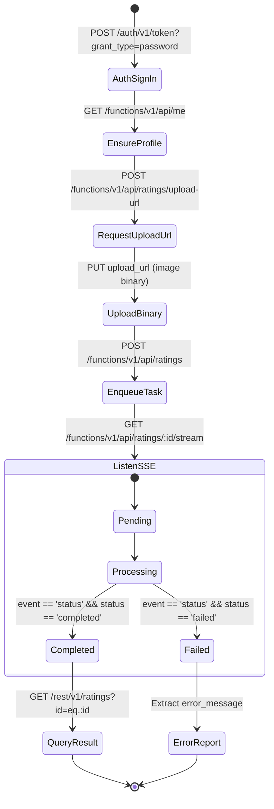

# SUPABASE MACHINE-READABLE API SPECIFICATION (AI AGENT PROTOCOL)

> **TARGET AUDIENCE**: AI Agents, Automated Execution Subagents, Autonomous Code Engines.  
> **DOMAIN**: Looksmaxxing AI Rating Platform (`mog`).  
> **CONTEXT**: Supabase Local (`127.0.0.1:54321`) & Production Gateways.  
> **SPECIFICATION VERSION**: 1.0.0  
> **DATA CONTRACT COMPLIANCE**: RFC 8259 (JSON), RFC 7231 (HTTP), PostgREST v12, GoTrue v2.

---

## 1. TOPOLOGY & GATEWAY CONFIGURATION

All HTTP traffic passes through the Supabase Kong API Gateway.

```
[Client / AI Agent]
         │
         ▼
[Kong API Gateway] (Port 54321)
   ├── /auth/v1/*        ──► GoTrue Auth Engine
   ├── /rest/v1/*        ──► PostgREST Data API (PostgreSQL 17)
   ├── /storage/v1/*     ──► Supabase Storage Service
   └── /functions/v1/api ──► Deno/Hono Edge Runtime
```

### 1.1 Base URIs (Local Development)
- **Root Gateway**: `http://127.0.0.1:54321`
- **GoTrue Auth API**: `http://127.0.0.1:54321/auth/v1`
- **PostgREST Data API**: `http://127.0.0.1:54321/rest/v1`
- **Supabase Storage API**: `http://127.0.0.1:54321/storage/v1`
- **Hono Edge Functions API**: `http://127.0.0.1:54321/functions/v1/api`

### 1.2 Universal Header Contracts
Every HTTP request to any API endpoint MUST include:

| Header | Format | Required By | Description |
| :--- | :--- | :--- | :--- |
| `apikey` | `<anon_key>` or `<service_role_key>` | ALL endpoints | Validates API project access in Kong |
| `Authorization` | `Bearer <access_token>` or `Bearer <service_role_key>` | Protected endpoints | Authenticates user identity (`auth.uid()`) or bypasses RLS |
| `Content-Type` | `application/json` | POST, PUT, PATCH | Enforces JSON body parsing |

---

## 2. AUTHENTICATION SERVICE (GoTrue API: `/auth/v1`)

Governs user registration, session creation, token refresh, and user lifecycle.

### 2.1 Password Sign-Up (`POST /auth/v1/signup`)
Registers a new user account. In local development (`enable_confirmations = false`), returns an active session immediately without email verification.

- **Endpoint**: `POST http://127.0.0.1:54321/auth/v1/signup`
- **Headers**:
  ```http
  apikey: <SUPABASE_ANON_KEY>
  Content-Type: application/json
  ```
- **Request Schema**:
  ```json
  {
    "email": "agent_user@example.com",
    "password": "SecurePassword123!",
    "data": {
      "username": "agent_user"
    }
  }
  ```
- **Response `200 OK`**:
  ```json
  {
    "access_token": "eyJhbGciOi...",
    "token_type": "bearer",
    "expires_in": 3600,
    "expires_at": 1726000000,
    "refresh_token": "u4g8...",
    "user": {
      "id": "a0000000-0000-0000-0000-000000000001",
      "aud": "authenticated",
      "role": "authenticated",
      "email": "agent_user@example.com",
      "email_confirmed_at": "2026-09-10T16:00:00Z",
      "user_metadata": {
        "username": "agent_user"
      },
      "created_at": "2026-09-10T16:00:00Z",
      "updated_at": "2026-09-10T16:00:00Z"
    }
  }
  ```

### 2.2 Password Sign-In (`POST /auth/v1/token?grant_type=password`)
Authenticates existing credentials and issues JWT session.

- **Endpoint**: `POST http://127.0.0.1:54321/auth/v1/token?grant_type=password`
- **Headers**:
  ```http
  apikey: <SUPABASE_ANON_KEY>
  Content-Type: application/json
  ```
- **Request Schema**:
  ```json
  {
    "email": "agent_user@example.com",
    "password": "SecurePassword123!"
  }
  ```
- **Response `200 OK`**: Same token response structure as 2.1.
- **Response `400 Bad Request`**:
  ```json
  {
    "error": "invalid_grant",
    "error_description": "Invalid login credentials"
  }
  ```

### 2.3 Token Refresh (`POST /auth/v1/token?grant_type=refresh_token`)
Rotates expired JWT `access_token` using `refresh_token`.

- **Endpoint**: `POST http://127.0.0.1:54321/auth/v1/token?grant_type=refresh_token`
- **Headers**:
  ```http
  apikey: <SUPABASE_ANON_KEY>
  Content-Type: application/json
  ```
- **Request Schema**:
  ```json
  {
    "refresh_token": "u4g8..."
  }
  ```
- **Response `200 OK`**: Returns new `access_token` and rotated `refresh_token`.

### 2.4 User Identity Inspection (`GET /auth/v1/user`)
Inspects current JWT claims directly via GoTrue.

- **Endpoint**: `GET http://127.0.0.1:54321/auth/v1/user`
- **Headers**:
  ```http
  apikey: <SUPABASE_ANON_KEY>
  Authorization: Bearer <access_token>
  ```
- **Response `200 OK`**: Returns user record object (`id`, `email`, `user_metadata`, etc.).

---

## 3. DATA API (PostgREST: `/rest/v1`)

Direct relational access to PostgreSQL tables with automatic Row-Level Security (RLS) enforcement.

### 3.1 Syntax Grammar & Query Conventions

```
Query URL Structure:
/rest/v1/<table_name>?<column>=<operator>.<value>&select=<projection>&order=<col>.<direction>&limit=<n>&offset=<m>
```

#### Comparison Operators:
- `eq.` — equals: `?status=eq.completed`
- `neq.` — not equal: `?status=neq.failed`
- `gt.` / `gte.` — greater than / or equal: `?score=gte.7.0`
- `lt.` / `lte.` — less than / or equal: `?score=lt.5.0`
- `like.` / `ilike.` — pattern matching (case sensitive / insensitive): `?username=ilike.agent*`
- `is.` — NULL checking: `?completed_at=is.null` or `?completed_at=not.is.null`
- `in.` — array membership: `?tier=in.(chad,chadlite)`
- `cs.` / `cd.` — JSONB contains / is contained by: `?metrics->>canthal_tilt=eq.positive`

#### Header Switches (`Prefer` header):
- `Prefer: return=representation` — Returns affected row(s) in JSON on INSERT/UPDATE/DELETE.
- `Prefer: return=minimal` — Returns empty body (`204 No Content` or `201 Created`).
- `Prefer: count=exact` — Returns total matched count in `Content-Range: 0-9/142`.

---

### 3.2 Table Specification: `profiles`

Maps 1:1 to `auth.users(id)`. Protected by RLS (`profiles_select_own`, `profiles_insert_own`, `profiles_update_own`).

#### Schema Definition:
| Field | PostgreSQL Type | Nullable | Default | RLS Rules |
| :--- | :--- | :--- | :--- | :--- |
| `id` | `uuid` (PK, FK `auth.users.id`) | NO | — | `auth.uid() = id` |
| `username` | `text` (UNIQUE) | YES | `null` | Modifiable by owner |
| `avatar_url` | `text` | YES | `null` | Modifiable by owner |
| `created_at` | `timestamptz` | NO | `now()` | Read-only |
| `updated_at` | `timestamptz` | NO | `now()` | Auto/Owner update |

#### 3.2.1 Read Own Profile
- **Request**:
  ```http
  GET /rest/v1/profiles?id=eq.<user_id>&select=* HTTP/1.1
  Host: 127.0.0.1:54321
  apikey: <SUPABASE_ANON_KEY>
  Authorization: Bearer <access_token>
  Accept: application/json
  ```
- **Response `200 OK`**:
  ```json
  [
    {
      "id": "a0000000-0000-0000-0000-000000000001",
      "username": "agent_user",
      "avatar_url": null,
      "created_at": "2026-09-10T16:00:00.000Z",
      "updated_at": "2026-09-10T16:00:00.000Z"
    }
  ]
  ```

#### 3.2.2 Update Profile Metadata
- **Request**:
  ```http
  PATCH /rest/v1/profiles?id=eq.<user_id> HTTP/1.1
  Host: 127.0.0.1:54321
  apikey: <SUPABASE_ANON_KEY>
  Authorization: Bearer <access_token>
  Prefer: return=representation
  Content-Type: application/json

  {
    "username": "agent_master_99",
    "avatar_url": "https://example.com/avatar.jpg"
  }
  ```
- **Response `200 OK`**:
  ```json
  [
    {
      "id": "a0000000-0000-0000-0000-000000000001",
      "username": "agent_master_99",
      "avatar_url": "https://example.com/avatar.jpg",
      "created_at": "2026-09-10T16:00:00.000Z",
      "updated_at": "2026-09-10T16:15:22.100Z"
    }
  ]
  ```

---

### 3.3 Table Specification: `ratings`

Stores analysis jobs and Groq AI inference outputs. Protected by RLS (`ratings_select_own`, `ratings_insert_own`, `ratings_update_own`, `ratings_delete_own`).

#### Schema Definition:
| Field | PostgreSQL Type | Nullable | Constraints & Enum Range |
| :--- | :--- | :--- | :--- |
| `id` | `uuid` (PK) | NO | Default: `gen_random_uuid()` |
| `user_id` | `uuid` (FK `profiles.id`) | NO | CASCADE on delete; Must match `auth.uid()` |
| `photo_path` | `text` | NO | Path in storage: `<user_id>/<file_uuid>.<ext>` |
| `status` | `rating_status` (ENUM) | NO | `'pending'`, `'processing'`, `'completed'`, `'failed'` |
| `tier` | `looksmaxxing_tier` (ENUM) | YES | `'sub3'`, `'ltn'`, `'mtn'`, `'htn'`, `'chadlite'`, `'chad'`, `'true_adam'` |
| `score` | `numeric(3, 1)` | YES | Value: `1.0` to `10.0` |
| `metrics` | `jsonb` | YES | Typed as `RatingMetrics` (see schema below) |
| `looksmaxxing_tips`| `jsonb` | YES | Array of strings (`string[]`) |
| `raw_ai_response` | `jsonb` | YES | Raw debugging object from AI SDK |
| `error_message` | `text` | YES | Populated when `status = 'failed'` |
| `created_at` | `timestamptz` | NO | Default: `now()` |
| `completed_at` | `timestamptz` | YES | Timestamp of worker finalization |

#### Nested JSONB Structure (`metrics`):
```json
{
  "canthal_tilt": "positive" | "neutral" | "negative",
  "jawline": 7.5,
  "symmetry": 8.0,
  "skin_quality": 6.8,
  "eye_area": 7.2,
  "cheekbones": 8.1
}
```

#### 3.3.1 Query User Ratings History (Pagination + Sorting)
- **Request**:
  ```http
  GET /rest/v1/ratings?select=id,status,tier,score,photo_path,created_at,completed_at&order=created_at.desc&limit=10&offset=0 HTTP/1.1
  Host: 127.0.0.1:54321
  apikey: <SUPABASE_ANON_KEY>
  Authorization: Bearer <access_token>
  ```
- **Response `200 OK`**:
  ```json
  [
    {
      "id": "e8d2e8b2-5f33-4ab7-b876-2fef87241234",
      "status": "completed",
      "tier": "htn",
      "score": 7.3,
      "photo_path": "a0000000-0000-0000-0000-000000000001/face_photo.jpg",
      "created_at": "2026-09-10T16:20:00.000Z",
      "completed_at": "2026-09-10T16:20:12.350Z"
    }
  ]
  ```

#### 3.3.2 Query Single Rating with Full Details & Profile Relation
- **Request**:
  ```http
  GET /rest/v1/ratings?id=eq.e8d2e8b2-5f33-4ab7-b876-2fef87241234&select=*,profile:profiles(*) HTTP/1.1
  Host: 127.0.0.1:54321
  apikey: <SUPABASE_ANON_KEY>
  Authorization: Bearer <access_token>
  Accept: application/vnd.pgrst.object+json
  ```
  *(Note: `Accept: application/vnd.pgrst.object+json` instructs PostgREST to return a single JSON object instead of an array).*
- **Response `200 OK`**:
  ```json
  {
    "id": "e8d2e8b2-5f33-4ab7-b876-2fef87241234",
    "user_id": "a0000000-0000-0000-0000-000000000001",
    "photo_path": "a0000000-0000-0000-0000-000000000001/face_photo.jpg",
    "status": "completed",
    "tier": "htn",
    "score": 7.3,
    "metrics": {
      "canthal_tilt": "positive",
      "jawline": 7.8,
      "symmetry": 7.5,
      "skin_quality": 6.9,
      "eye_area": 7.4,
      "cheekbones": 7.0
    },
    "looksmaxxing_tips": [
      "Improve sleep hygiene to reduce under-eye dark circles",
      "Incorporate daily SPF and tretinoin for skin texture"
    ],
    "raw_ai_response": {},
    "error_message": null,
    "created_at": "2026-09-10T16:20:00.000Z",
    "completed_at": "2026-09-10T16:20:12.350Z",
    "profile": {
      "id": "a0000000-0000-0000-0000-000000000001",
      "username": "agent_user",
      "avatar_url": null,
      "created_at": "2026-09-10T16:00:00.000Z",
      "updated_at": "2026-09-10T16:00:00.000Z"
    }
  }
  ```

#### 3.3.3 Delete Rating Record
- **Request**:
  ```http
  DELETE /rest/v1/ratings?id=eq.e8d2e8b2-5f33-4ab7-b876-2fef87241234 HTTP/1.1
  Host: 127.0.0.1:54321
  apikey: <SUPABASE_ANON_KEY>
  Authorization: Bearer <access_token>
  Prefer: return=minimal
  ```
- **Response `204 No Content`**

---

### 3.4 Stored Procedure Execution (PostgREST RPC: `/rest/v1/rpc/*`)

Direct execution of PostgreSQL routines defined in `public`.

#### Enqueue Rating Task (`POST /rest/v1/rpc/enqueue_rating_task`)
*Low-level alternative to the Edge Function route. Inserts a task directly into `pgmq` queue `rating_tasks`.*

- **Endpoint**: `POST http://127.0.0.1:54321/rest/v1/rpc/enqueue_rating_task`
- **Headers**:
  ```http
  apikey: <SUPABASE_ANON_KEY>
  Authorization: Bearer <access_token>
  Content-Type: application/json
  ```
- **Request Schema**:
  ```json
  {
    "p_rating_id": "e8d2e8b2-5f33-4ab7-b876-2fef87241234",
    "p_user_id": "a0000000-0000-0000-0000-000000000001",
    "p_photo_path": "a0000000-0000-0000-0000-000000000001/face_photo.jpg",
    "p_rating_mode": "honest"
  }
  ```
- **Response `200 OK`**:
  ```json
  1042
  ```
  *(Returns `bigint` containing the `pgmq.msg_id`).*

---

## 4. STORAGE API (Supabase Storage: `/storage/v1`)

Governs file blobs in the private bucket `ratings_photos`. Direct unauthenticated reads are forbidden.

### 4.1 Storage Endpoints & Signed Access
- **Private Bucket Name**: `ratings_photos`
- **Allowed MIME Types**: `image/jpeg`, `image/png`, `image/webp`, `image/heic`
- **Max File Size**: 15 MB (`15728640` bytes)

#### Binary Upload via Pre-signed Upload URL
The upload URL is obtained from `POST /functions/v1/api/ratings/upload-url` (see Section 5.3).
- **HTTP Method**: `PUT`
- **URL**: Pre-signed URL string (e.g. `http://127.0.0.1:54321/storage/v1/object/upload/sign/ratings_photos/<userId>/<fileId>.jpg?token=<uploadToken>`)
- **Headers**:
  ```http
  Content-Type: image/jpeg
  ```
- **Body**: Raw image binary payload.
- **Response `200 OK`**:
  ```json
  {
    "Key": "ratings_photos/<userId>/<fileId>.jpg"
  }
  ```

#### Create Signed Read URL (Authenticated)
- **Endpoint**: `POST http://127.0.0.1:54321/storage/v1/object/sign/ratings_photos/<path>`
- **Headers**:
  ```http
  apikey: <SUPABASE_ANON_KEY>
  Authorization: Bearer <access_token>
  Content-Type: application/json
  ```
- **Request Schema**:
  ```json
  {
    "expiresIn": 3600
  }
  ```
- **Response `200 OK`**:
  ```json
  {
    "signedURL": "/storage/v1/object/sign/ratings_photos/<path>?token=ey..."
  }
  ```

---

## 5. EDGE API (Hono Edge Functions: `/functions/v1/api`)

Specialized business orchestration layer running on Deno/Edge Runtime. Encapsulates complex workflows (pre-signed upload generation, queue dispatch, SSE streaming).

### 5.1 Route Aliasing & Paths
The Edge Function handles multiple base prefixes identically:
- `/functions/v1/api/*` (Standard Supabase Gateway route)
- `/api/*` (Custom reverse proxy)
- `/*` (Direct function invocation)

---

### 5.2 System Health (`GET /functions/v1/api/health`)
- **Headers**: `apikey: <SUPABASE_ANON_KEY>`
- **Response `200 OK`**:
  ```json
  {
    "status": "ok",
    "timestamp": "2026-09-10T16:30:00.000Z"
  }
  ```

---

### 5.3 User Profile Lazy Upsert (`GET /functions/v1/api/me`)
Retrieves the profile for the JWT caller. Automatically inserts a record in `public.profiles` if missing.

- **Headers**:
  ```http
  apikey: <SUPABASE_ANON_KEY>
  Authorization: Bearer <access_token>
  ```
- **Response `200 OK`**:
  ```json
  {
    "user": {
      "id": "a0000000-0000-0000-0000-000000000001",
      "email": "agent_user@example.com",
      "phone": null,
      "created_at": "2026-09-10T16:00:00Z"
    },
    "profile": {
      "id": "a0000000-0000-0000-0000-000000000001",
      "username": "agent_user",
      "avatar_url": null,
      "created_at": "2026-09-10T16:00:00.000Z",
      "updated_at": "2026-09-10T16:00:00.000Z"
    }
  }
  ```

---

### 5.4 Pre-signed Upload URL Request (`POST /functions/v1/api/ratings/upload-url`)
Allocates a file path in `ratings_photos` and returns a 15-minute signed PUT URL.

- **Headers**:
  ```http
  apikey: <SUPABASE_ANON_KEY>
  Authorization: Bearer <access_token>
  Content-Type: application/json
  ```
- **Request Schema (Zod: `uploadUrlRequestSchema`)**:
  ```json
  {
    "content_type": "image/jpeg"
  }
  ```
  *OR*
  ```json
  {
    "extension": "jpg"
  }
  ```
  *(Constraint: One of `content_type` or `extension` is strictly required. Permitted extensions: `jpg`, `jpeg`, `png`, `webp`, `heic`).*

- **Response `200 OK`**:
  ```json
  {
    "upload_url": "http://127.0.0.1:54321/storage/v1/object/upload/sign/ratings_photos/a0000000-0000-0000-0000-000000000001/c82662fa-3882-411a-8c8c-1e82e2124567.jpg?token=ey...",
    "photo_path": "a0000000-0000-0000-0000-000000000001/c82662fa-3882-411a-8c8c-1e82e2124567.jpg",
    "token": "ey...",
    "expires_in": 900
  }
  ```

- **Response `400 Bad Request`**:
  ```json
  {
    "error": "ValidationError",
    "message": "Неверные параметры для генерации URL загрузки",
    "issues": [
      {
        "code": "custom",
        "message": "Необходимо указать хотя бы один из параметров: content_type или extension",
        "path": ["content_type"]
      }
    ]
  }
  ```

---

### 5.5 Register & Enqueue Rating (`POST /functions/v1/api/ratings`)
Registers the uploaded photo, inserts a database row in `ratings` (`status='pending'`), and pushes a message to `pgmq.rating_tasks`.

- **Headers**:
  ```http
  apikey: <SUPABASE_ANON_KEY>
  Authorization: Bearer <access_token>
  Content-Type: application/json
  ```
- **Request Schema (Zod: `createRatingRequestSchema`)**:
  ```json
  {
    "photo_path": "a0000000-0000-0000-0000-000000000001/c82662fa-3882-411a-8c8c-1e82e2124567.jpg",
    "rating_mode": "honest",
    "rating_id": "e8d2e8b2-5f33-4ab7-b876-2fef87241234"
  }
  ```
  - `photo_path` (string, required): Must start with caller's user UUID (`<user_id>/...`).
  - `rating_mode` (string, optional): Enum `'honest'` (default), `'brutal'`, `'soft'`.
  - `rating_id` (UUID, optional): Idempotent client-generated key. If omitted, database generates UUID.

- **Response `201 Created`**:
  ```json
  {
    "rating_id": "e8d2e8b2-5f33-4ab7-b876-2fef87241234",
    "status": "pending",
    "photo_path": "a0000000-0000-0000-0000-000000000001/c82662fa-3882-411a-8c8c-1e82e2124567.jpg",
    "rating_mode": "honest",
    "queue_msg_id": 1042,
    "created_at": "2026-09-10T16:32:00.000Z"
  }
  ```

- **Response `200 OK` (Idempotent replay)**:
  Returned if `rating_id` has already been registered.
  ```json
  {
    "message": "Оценка с таким ID уже зарегистрирована",
    "rating_id": "e8d2e8b2-5f33-4ab7-b876-2fef87241234",
    "status": "pending",
    "photo_path": "a0000000-0000-0000-0000-000000000001/c82662fa-3882-411a-8c8c-1e82e2124567.jpg",
    "created_at": "2026-09-10T16:32:00.000Z"
  }
  ```

- **Response `403 Forbidden`**:
  Returned if `photo_path` does not begin with caller's user ID.
  ```json
  {
    "error": "Forbidden",
    "message": "photo_path должен принадлежать текущему пользователю (<user_id>/...)"
  }
  ```

---

### 5.6 Real-Time Status Stream (`GET /functions/v1/api/ratings/:id/stream`)
Server-Sent Events (SSE) pipe streaming live status transitions (`pending` -> `processing` -> `completed` / `failed`).

- **Endpoint**: `GET http://127.0.0.1:54321/functions/v1/api/ratings/<rating_id>/stream`
- **Headers**:
  ```http
  apikey: <SUPABASE_ANON_KEY>
  Authorization: Bearer <access_token>
  Accept: text/event-stream
  ```
  *(Alternative token delivery for standard EventSource clients: `?token=<access_token>` or `?access_token=<access_token>`)*

- **Response Headers**:
  ```http
  Content-Type: text/event-stream
  Cache-Control: no-cache
  Connection: keep-alive
  ```

#### Stream Event Protocol:

1. **Initial Status Event**:
   ```
   event: status
   data: {"id":"e8d2e8b2-...","status":"pending","created_at":"..."}
   ```

2. **Heartbeat Keep-Alive Event** (every ~6 seconds):
   ```
   event: ping
   data: {"timestamp":"2026-09-10T16:32:06.000Z","status":"processing"}
   ```

3. **Status Transition Event (`processing`)**:
   ```
   event: status
   data: {"id":"e8d2e8b2-...","status":"processing",...}
   ```

4. **Terminal Event (`completed`)**:
   ```
   event: status
   data: {"id":"e8d2e8b2-...","status":"completed","tier":"htn","score":7.3,"metrics":{"canthal_tilt":"positive","jawline":7.8,"symmetry":7.5,"skin_quality":6.9,"eye_area":7.4,"cheekbones":7.0},"looksmaxxing_tips":["Improve sleep hygiene..."],"completed_at":"2026-09-10T16:32:15.120Z","photo_url":"http://127.0.0.1:54321/storage/v1/object/sign/ratings_photos/..."}
   ```
   *(Connection automatically closes after `completed` or `failed` event, or on 120-second timeout).*

---

## 6. COMPLETE AI AGENT EXECUTION STATE MACHINE



### Deterministic cURL Execution Script

```bash
#!/usr/bin/env bash
set -euo pipefail

BASE_URL="http://127.0.0.1:54321"
ANON_KEY="<SUPABASE_ANON_KEY>"
EMAIL="agent@example.com"
PASSWORD="AgentPassword123!"
IMAGE_FILE="./face.jpg"

# 1. Sign In
AUTH_RES=$(curl -s -X POST "$BASE_URL/auth/v1/token?grant_type=password" \
  -H "apikey: $ANON_KEY" \
  -H "Content-Type: application/json" \
  -d "{\"email\":\"$EMAIL\",\"password\":\"$PASSWORD\"}")

ACCESS_TOKEN=$(echo "$AUTH_RES" | jq -r '.access_token')
USER_ID=$(echo "$AUTH_RES" | jq -r '.user.id')

# 2. Get Upload URL
UPLOAD_PLAN=$(curl -s -X POST "$BASE_URL/functions/v1/api/ratings/upload-url" \
  -H "apikey: $ANON_KEY" \
  -H "Authorization: Bearer $ACCESS_TOKEN" \
  -H "Content-Type: application/json" \
  -d '{"content_type":"image/jpeg"}')

UPLOAD_URL=$(echo "$UPLOAD_PLAN" | jq -r '.upload_url')
PHOTO_PATH=$(echo "$UPLOAD_PLAN" | jq -r '.photo_path')

# 3. Binary Upload to Storage
curl -s -X PUT "$UPLOAD_URL" \
  -H "Content-Type: image/jpeg" \
  --data-binary "@$IMAGE_FILE"

# 4. Enqueue Rating Task
RATING_RES=$(curl -s -X POST "$BASE_URL/functions/v1/api/ratings" \
  -H "apikey: $ANON_KEY" \
  -H "Authorization: Bearer $ACCESS_TOKEN" \
  -H "Content-Type: application/json" \
  -d "{\"photo_path\":\"$PHOTO_PATH\",\"rating_mode\":\"honest\"}")

RATING_ID=$(echo "$RATING_RES" | jq -r '.rating_id')
echo "Task Enqueued. Rating ID: $RATING_ID"

# 5. Stream Live Results (SSE)
curl -N -s -X GET "$BASE_URL/functions/v1/api/ratings/$RATING_ID/stream" \
  -H "apikey: $ANON_KEY" \
  -H "Authorization: Bearer $ACCESS_TOKEN" \
  -H "Accept: text/event-stream"
```

---

## 7. ERROR TAXONOMY & RECOVERY STRATEGIES

| HTTP Status | Error Code | Root Cause | Agent Action / Recovery Strategy |
| :--- | :--- | :--- | :--- |
| `401` | `Unauthorized` | Token expired, invalid JWT, or missing `apikey` | Re-authenticate via `POST /auth/v1/token?grant_type=refresh_token`. Retry request. |
| `403` | `Forbidden` | RLS violation or `photo_path` mismatch (`user_id` does not match JWT `sub`) | Validate that `photo_path` is prefixed with the caller's UUID (`user.id`). Verify RLS rules. |
| `400` | `ValidationError` | Zod schema validation rejected inputs | Inspect `issues` array in error response; match input types against Zod schemas in Section 5. |
| `404` | `NotFound` | Specified `rating_id` does not exist or was deleted | Verify UUID syntax; check if record exists in `/rest/v1/ratings?id=eq.<id>`. |
| `500` | `QueueError` | `pgmq` extension failure or Postgres connection limit exceeded | Worker/Queue is down. Check local Docker containers via `bunx supabase status`. |
| `429` | `Too Many Requests` | Free-tier Groq API limit reached in background worker | **Do not hammer the API**. The worker automatically invokes `pgmq.set_vt` and exponential backoff. Wait for SSE event or poll `/rest/v1/ratings` after 30 seconds. |
